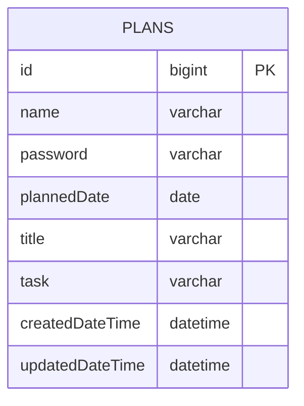

# 🗓️ Creating a Planner Application Using Spring Boot

## 💻 Introduction
- This project is an assignment designed to evaluate students' understanding of the online lecture.
- The application is developed as a personal project.
- The application is designed with a console-based user interface.
  
## 📆 Development Period
- **Study**: 29/11/2024 – 03/12/2024
- **Development**: 03/12/2024 – 10/12/2024

## 🛠️ Tech Stack
- Java 17
- Spring Boot 3.4.0
- MySQL 9.1.0
- JdbcTemplate

## 🔗 ERD



### ERD Note
- The SQL database table name of `PLANS` is `planner`.

## 📜 API Specification 
### Basic Information 
- Base URL: /plans
- Response Format: JSON
- Character Encoding: UTF-8

### API List
| Method | URI                    | Description             | Request Parameters                             | Response Code |
|--------|------------------------|-------------------------|------------------------------------------------|---------------|
| POST   | /plans                 | Create plan             | name, password, plannedDate, title, task       | 201           |
| GET    | /plans                 | Read all plans          | name, updatedDate                              | 200           |
| GET    | /plans/{id}            | Read specific plan      | id                                             | 200           |
| PATCH  | /plans/{id}            | Update plan partially   | id, name, password, plannedDate, title, task   | 200           |
| DELETE | /plans/{id}            | Delete plan             | id, password                                   | 200           |

### API Details
#### Request Body Details
1. **`POST` Create Plan**
    ```json
    {
        "name" : "사용자명",
        "password" : "비밀번호",
        "plannedDate" : "일정 날짜",
        "title" : "일정 제목",
        "task" : "일정 내용"
    }
    ```

2. **`PATCH` Update Plan**
    ```json
    {
        "name" : "사용자명",
        "password" : "비밀번호",
        "plannedDate" : "일정 날짜",
        "title" : "일정 제목",
        "task" : "일정 내용"
    }
    ```
 
3. **`DELETE` Delete Plan**
    ```json
    {
        "password" : "비밀번호"
    }
    ```

#### Response Body Details
1. **`GET` Read All Plans**
    ```json
    [
        {
            "id" : 1,
            "name" : "사용자명",
            "plannedDate" : "일정 날짜",
            "title" : "일정 제목",
            "task" : "일정 내용",
            "createdDateTime" : "2024-12-10T13:49:42",
            "updatedDateTime" : "2024-12-10T13:49:42"
        },
        {
            "id" : 2,
            "name" : "사용자명2",
            "plannedDate" : "일정 날짜2",
            "title" : "일정 제목2",
            "task" : "일정 내용2",
            "createdDateTime" : "2024-12-10T14:00:00",
            "updatedDateTime" : "2024-12-10T14:00:00"
        }
    ]
    ```

3. **`GET` Read Specific Plan**
    ```json
    {
        "id" : 1,
        "name" : "사용자명",
        "plannedDate" : "일정 날짜",
        "title" : "일정 제목",
        "task" : "일정 내용",
        "createdDateTime" : "2024-12-10T13:49:42",
        "updatedDateTime" : "2024-12-10T13:49:42"
    }
    ```

### Error Response Code
| HTTP Status | Description              | Message Example                  |
|-------------|--------------------------|----------------------------------|
| 400         | Bad Request              | "Password does not match"        |
| 404         | Not Found                | "Id does not exist"              |
| 500         | Internal Server Error    | "Internal Server Error occurred" |

### Request Body Description
#### Field Information
| Field Name      | Data Type  | Mandatory Status     | Description                                 |
|-----------------|------------|----------------------|---------------------------------------------|
| **id**          | Long       | Mandatory / Optional | Identifier for each plan                    |
| **name**        | String     | Mandatory / Optional | Member's name (less than 30 characters)     |
| **password**    | String     | Mandatory            | Member's password (more than 10 characters) |
| **plannedDate** | LocalDate  | Mandatory            | Date of the plan (e.g., "2024-12-10")       |
| **title**       | String     | Mandatory            | Title of the plan                           |
| **task**        | String     | Mandatory            | Detailed description of the plan            |
| **updatedDate** | LocalDate  | Optional             | Date the plan was last edited               |

## Database Schema
```sql
CREATE TABLE planner
(
    id              BIGINT AUTO_INCREMENT COMMENT '일정 식별자'
        PRIMARY KEY,
    name            VARCHAR(50)  NOT NULL COMMENT '작성자명',
    password        VARCHAR(50)  NOT NULL COMMENT '비밀번호',
    plannedDate     DATE         NOT NULL COMMENT '일정 날짜',
    title           VARCHAR(50)  NOT NULL COMMENT '일정 제목',
    task            VARCHAR(100) NULL COMMENT '일정 내용',
    createdDateTime DATETIME     NOT NULL COMMENT '생성 날짜',
    updatedDateTime DATETIME     NOT NULL COMMENT '수정 날짜'
);
```

## 🚀 Key Features
- Implement CRUD functionality for plans.
- Read specific plans by filtering `name` or `updatedDate`.
- Save data in an SQL database using JdbcTemplate.
- Provide password validation when updating or deleting a plan.

## 📜 More Information
- [Visit Development Journal](https://writingforever162.tistory.com)
- [Visit Troubleshooting Records](https://writingforever162.tistory.com/category/Troubleshooting%3A%20%EB%AC%B4%EC%97%87%EC%9D%B4%20%EB%AC%B8%EC%A0%9C%EC%98%80%EB%8A%94%EA%B0%80%3F)
