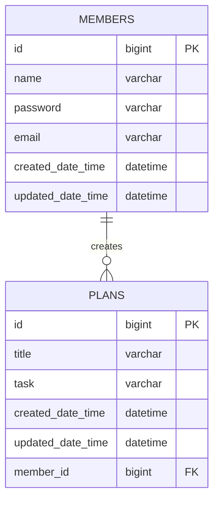

# 🗓️ Creating a Planner Application Using Spring Boot

## 💻 Introduction
- This project is an assignment designed to evaluate students' understanding of the online lecture.
- The application is developed as a personal project.
- The application designed with a console-based user interface.
  
## 📆 Development Period
- **Study**: 29/11/2024 – 03/12/2024
- **Development**: 03/12/2024 – 10/12/2024

## 💻 Tech Stack
- Java 17
- Spring Boot 3.4.0
- MySQL 9.1.0
- JdbcTemplate

## 🔗 ERD



## 📜 API Specification 
### Basic Information 
- Base URL (plan): /plans
- Base URL (member): /members
- Response Format: JSON
- Character Encoding: UTF-8
- Assumption: The members using the app are already stored in the database, and the API documentation has been written accordingly.

### API List
| Method | URI           | Description            | Request Parameters                           | Response Code |
|--------|---------------|------------------------|----------------------------------------------|---------------|
| POST   | /plans        | Create plan            | memberId, password, plannedDate, title, task | 201           |
| GET    | /plans        | Read all plans         | memberId, updatedDate                        | 200           |
| GET    | /plans/{id}   | Read specific plans    | planId                                       | 200           | 
| PATCH  | /plans/{id}   | Update plan partially  | planId, password, plannedDate, title, task   | 200           |
| PATCH  | /members/{id} | Update member name     | memberId, name                               | 200           |
| DELETE | /plans/{id}   | Delete plan            | planId, password                             | 200           |

### API Details
#### Request Body Details
1. **`POST` Create Plan**
    ```json
    {
        "memberId" : "사용자 고유 식별자",
        "password" : "비밀번호",
        "plannedDate" : "일정 날짜",
        "title" : "일정 제목",
        "task" : "일정 내용"
    }
    ```

2. **`PATCH` Update Plan**
    ```json
    {
        "password" : "비밀번호",
        "plannedDate" : "일정 날짜",
        "title" : "일정 제목",
        "task" : "일정 내용"
    }
    ```

3. **`PATCH` Update Member Name**
    ```json
    {
        "name" : "사용자명"
    }
    ```

4. **`DELETE` Delete Plan**
   ```json
   {
   "password" : "비밀번호"
   }
    ```

#### Response Body Details
1. **`GET` Read All Plans**
    ```json
    [
        {
            "planId" : 1,
            "memberId" : 1,
            "plannedDate" : "일정 날짜",
            "title" : "일정 제목",
            "task" : "일정 내용",
            "createdDateTime" : "2024-12-10T13:49:42",
            "updatedDateTime" : "2024-12-10T13:49:42"
        },
        {
            "planId" : 2,
            "memberId" : 2,
            "plannedDate" : "일정 날짜2",
            "title" : "일정 제목2",
            "task" : "일정 내용2",
            "createdDateTime" : "2024-12-10T12:10:00",
            "updatedDateTime" : "2024-12-10T12:10:00"
        }
    ]
    ```

2. **`GET` Read Specific Plan**
    ```json
    {
        "planId" : 3,
        "memberId" : 3,
        "plannedDate" : "일정 날짜",
        "title" : "일정 제목",
        "task" : "일정 내용",
        "createdDateTime" : "2024-12-08T11:35:59",
        "updatedDateTime" : "2024-12-10T12:21:42"
    }
    ```

### Error Response Code
| HTTP Status | Description              | Message Example                  |
|-------------|--------------------------|----------------------------------|
| 400         | Bad Request              | "Password does not match"        |
| 404         | Not Found                | "Id does not exist"              |
| 500         | Internal Server Error    | "Internal Server Error occurred" |

### Request Body Description
#### Field Information
| Field Name      | Data Type | Mandatory Status     | Description                                 |
|-----------------|-----------|----------------------|---------------------------------------------|
| **planId**      | Long      | Mandatory / Optional | Identifier for each plan                    |
| **memberId**    | Long      | Mandatory / Optional | Identifier for eah member                   |
| **name**        | String    | Mandatory            | Member's name (less than 30 characters)     |
| **password**    | String    | Mandatory            | Member's password (more than 10 characters) |
| **plannedDate** | LocalDate | Mandatory            | Date of the plan (e.g., "2024-12-10")       |
| **title**       | String    | Mandatory            | Title of the plan                           |
| **task**        | String    | Mandatory            | Detailed description of the plan            |
| **updatedDate** | LocalDate | Optional             | Date the plan was last edited               |

## Database Schema
### 1. MEMBERS
```sql
CREATE TABLE PLANNER_CHALLENGE_MEMBERS
(
  ID                BIGINT AUTO_INCREMENT COMMENT '사용자 식별자'
        PRIMARY KEY,
  NAME              VARCHAR(50) NOT NULL COMMENT '사용자명',
  EMAIL             VARCHAR(50) NOT NULL COMMENT '이메일',
  CREATED_DATE_TIME DATETIME NOT NULL COMMENT '사용자 등록일',
  UPDATED_DATE_TIME DATETIME NOT NULL COMMENT '사용자 수정일'
);
```

### 2. PLANS
```sql
CREATE TABLE PLANNER_CHALLENGE_PLANS
(
    ID                BIGINT AUTO_INCREMENT COMMENT '일정 식별자'
        PRIMARY KEY,
    MEMBER_ID         BIGINT       NOT NULL,
    PASSWORD          VARCHAR(50)  NOT NULL COMMENT '비밀번호',
    PLANNED_DATE      DATE         NOT NULL COMMENT '일정 날짜',
    TITLE             VARCHAR(50)  NOT NULL COMMENT '일정 제목',
    TASK              VARCHAR(100) NULL COMMENT '일정 내용',
    CREATED_DATE_TIME DATETIME     NOT NULL COMMENT '일정 생성일',
    UPDATED_DATE_TIME DATETIME     NOT NULL COMMENT '일정 수정일',
    CONSTRAINT PLANNER_CHALLENGE_PLANS_IBFK_1
        FOREIGN KEY (MEMBER_ID) REFERENCES PLANNER_CHALLENGE_MEMBERS (ID)
);

CREATE INDEX MEMBER_ID
    ON PLANNER_CHALLENGE_PLANS (MEMBER_ID);

```
## 🚀 Key Features
- Implement CRUD functionality for plans.
- Read specific plans by filtering `memberId` or `updatedDate`.
- Save data in an SQL database using JdbcTemplate.
- Provide password validation when updating or deleting a plan.
- Provide a function to update the `name`.
  
## 🔍 Characteristics
- Separate the 3-layer architecture and DTOs into different packages by URL

## 📜 More Information
- [Visit Development Journal](https://writingforever162.tistory.com)
- [Visit Troubleshooting Records](https://writingforever162.tistory.com/category/Troubleshooting%3A%20%EB%AC%B4%EC%97%87%EC%9D%B4%20%EB%AC%B8%EC%A0%9C%EC%98%80%EB%8A%94%EA%B0%80%3F)