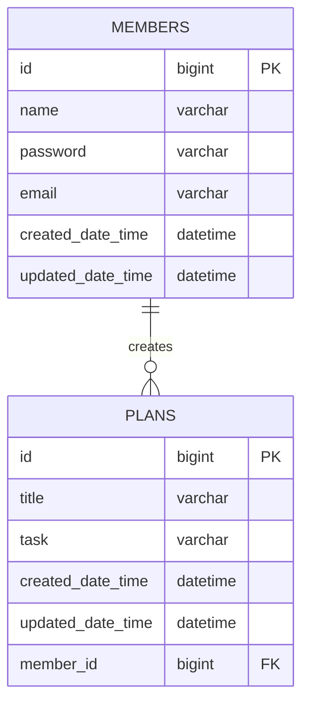

# 🗓️ Creating a Planner Application Using Spring Boot

## 💻 Introduction
- This project is an assignment designed to evaluate students' understanding of the online lecture.
- The application is developed as a personal project.
- The application designed with a console-based user interface.
  
## 📆 Development Period
- **Study**: 29/11/2024 – 03/12/2024
- **Development**: 03/12/2024 – 10/12/2024

## 💻 Tech Stack
- Java 17
- Spring Boot 3.4.0
- MySQL 9.1.0
- JdbcTemplate

## 🔗 ERD



## 📜 API Specification 
### Basic Information 
- Base URL (plan): /plans
- Base URL (member): /members
- Response Format: JSON
- Character Encoding: UTF-8

### API List
| Method | URI           | Description            | Request Parameters                         | Response Code |
|--------|---------------|------------------------|--------------------------------------------|---------------|
| POST   | /plans        | Create plan            | name, password, plannedDate, title, task   | 201           |
| GET    | /plans        | Read all plans         | memberId, updatedDate                      | 200           |
| GET    | /plans/{id}   | Read specific plans    | planId                                     | 200           | 
| PATCH  | /plans/{id}   | Update plan partially  | planId, password, plannedDate, title, task | 200           |
| PATCH  | /members/{id} | Update member name     | memberId, name                             | 200           |
| DELETE | /plans/{id}   | Delete plan            | planId, password                           | 200           |

### API Details
#### Request Body Details
1. **`POST` Create Plan**
    ```json
    {
        "name" : "사용자명",
        "password" : "비밀번호",
        "plannedDate" : "일정 날짜",
        "title" : "일정 제목",
        "task" : "일정 내용"
    }
    ```

2. **`GET` Get Plan**
3. **`PATCH` Update Plan**
4. **`DELETE` Delete Plan** 

#### Response Body Details


## 🚀 Level

### 1️⃣ 
- **Characteristics**
  - 
  - 
- **Features** 
  - 
  - 
  - 
- **Usage**: 

## 📜 More Information
- [Visit Development Journal](https://writingforever162.tistory.com)
- [Visit Troubleshooting Records](https://writingforever162.tistory.com/category/Troubleshooting%3A%20%EB%AC%B4%EC%97%87%EC%9D%B4%20%EB%AC%B8%EC%A0%9C%EC%98%80%EB%8A%94%EA%B0%80%3F)
